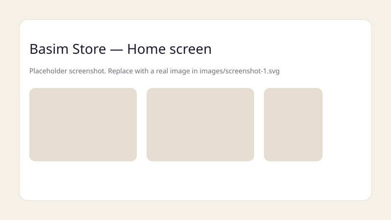
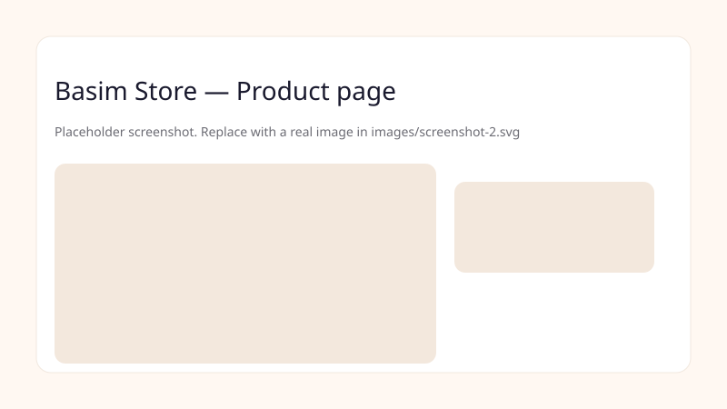

# Basim Store — v2

A lightweight static storefront (HTML/CSS) for Basim Store — version 2. This repo contains the static frontend used for a small e-commerce demo and GitHub Pages hosting.

Important — Legal & usage
- Yeh repository sirf demo/educational purposes ke liye hai. Copyrighted material ko bina ijazat use na karein.
- Do not commit secrets or API keys to this repo.

What’s included
- `index.html` — Full frontend UI (home, collection, profile, cart UI etc.)
- Static assets (images/icons) may be in the repo root or an `assets/` folder

Features
- Responsive static HTML/CSS UI inspired by modern mobile storefronts
- Dark / light theme, Urdu/English language support hooks
- Sections: Home, Collection (product grid), Wishlist, Orders, Profile
- Mobile-first layout suitable for GitHub Pages

Quick start (view locally)
1. Clone repository:
   `git clone https://github.com/basimstore-com/basimstore-v2.git`
2. Open the folder:
   `cd basimstore-v2`
3. Serve locally (recommended):
   - Python 3:
     `python3 -m http.server 8000`
     open `http://localhost:8000`
   - Or use any static file server (http-server, live-server)

Screenshots
(Place real screenshots in `images/` and replace these placeholders)

How to deploy to GitHub Pages
1. Push branch to GitHub and open Settings → Pages, set source to `main` or `gh-pages` branch.
2. For this static site, GitHub Pages will serve `index.html` automatically.

Suggestions / Next steps
- Add a `LICENSE` (MIT recommended).
- Add `CONTRIBUTING.md` for contributors.
- Add a small CI workflow to validate HTML/CSS linting (`.github/workflows/ci.yml`).
- If you plan to add a backend for APIs, keep keys out of the repo and use environment variables.

Contact
Project maintained by basimstore-com. For changes or help, open an issue or PR.
